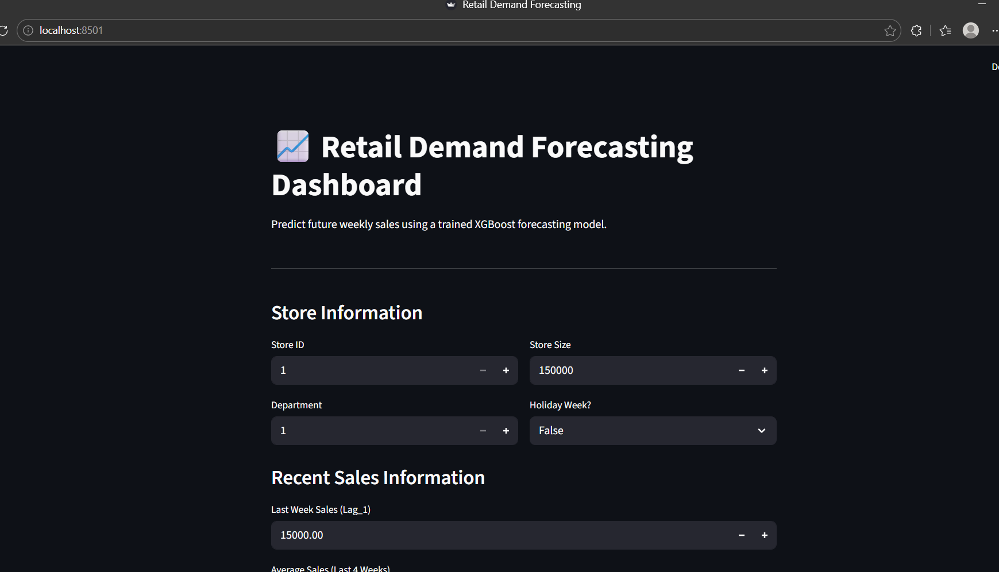
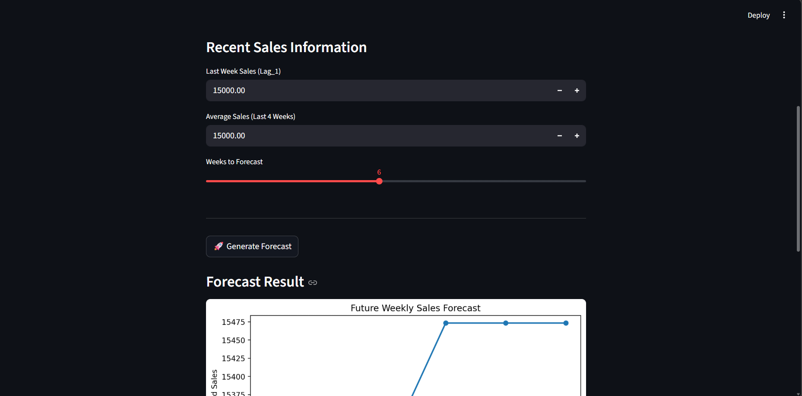
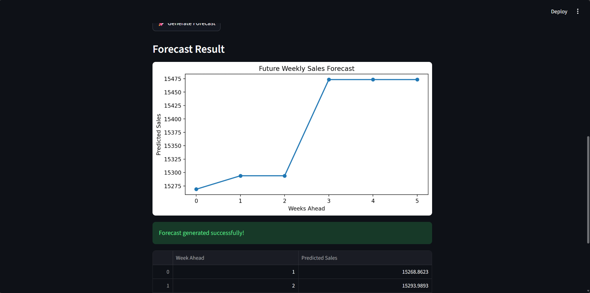

# 📈 Retail Demand Forecasting System

An end-to-end Machine Learning project that predicts future retail sales using time-series feature engineering and XGBoost forecasting, deployed as an interactive Streamlit dashboard.

---

## 🖼️ Dashboard Preview

<p align="center">
  
</p>

<p align="center">
  
</p>

<p align="center">
  
</p>

---

## 🚀 Project Overview

Retail companies rely on accurate demand forecasting to optimize inventory planning, staffing, and promotional strategies. Poor forecasts lead to overstocking or stock shortages, directly impacting revenue.

This project builds a complete retail demand forecasting pipeline using historical Walmart sales data and machine learning techniques to predict future weekly sales.

The system includes:

- Data preprocessing & exploratory analysis
- Time-series feature engineering
- Model training & evaluation
- Recursive future forecasting
- Interactive Streamlit dashboard deployment

---

## 🎯 Problem Statement

Predict future weekly sales for retail stores using historical sales patterns and external factors such as holidays, promotions, and economic indicators.

The goal is to simulate a real-world forecasting system used in retail analytics.

---

## 📊 Dataset

Walmart Store Sales Forecasting Dataset

Features include:

- Store ID
- Department ID
- Weekly Sales
- Holiday Indicator (`IsHoliday`)
- Temperature
- Fuel Price
- Consumer Price Index (CPI)
- Unemployment Rate
- Promotional Markdowns
- Store Type & Size

---

## 🔍 Exploratory Data Analysis (EDA)

Key insights discovered:

- Sales show strong seasonal patterns.
- Holiday weeks significantly influence demand.
- Promotions create short-term spikes.
- Economic indicators have weaker short-term effects.

Visualizations performed:

- Sales trends over time
- Holiday vs non-holiday analysis
- Store performance comparison
- Feature correlation analysis

---

## ⚙️ Feature Engineering

Time-series features were created to capture temporal dependency:

### Lag Features
- `Lag_1` → Previous week sales
- `Lag_4` → Sales 4 weeks ago

### Rolling Statistics
- `Rolling_Mean_4` → Average sales over last 4 weeks

### Date-based Features
- Year
- Month
- Week
- Day of Week

These features allow the model to learn demand momentum.

---

## 🤖 Model Development

### Baseline Model
- Random Forest Regressor

### Final Model
- XGBoost Regressor

XGBoost was selected due to superior performance on tabular forecasting data.

---

## 📈 Model Performance

| Model | MAE | RMSE |
|------|-----|------|
| Random Forest | 1280 | 2981 |
| XGBoost | **1200** | **2678** |

### Interpretation

The final model achieves approximately 7–8% prediction error relative to average weekly sales, indicating strong forecasting accuracy.

---

## 🔁 Recursive Forecasting

A recursive forecasting strategy was implemented:

1. Predict next week's sales.
2. Use prediction as input lag feature.
3. Repeat for future time steps.

This simulates real-world forecasting where future actual sales are unknown.

---

## 🖥️ Streamlit Dashboard

The interactive dashboard allows users to:

- Select Store and Department
- Input recent sales information
- Specify holiday weeks
- Forecast future sales
- Visualize predictions dynamically

Dashboard features:

- Real-time predictions
- Interactive controls
- Forecast visualization
- Tabular results display

---

## 🛠️ Tech Stack

- Python
- Pandas
- NumPy
- Scikit-learn
- XGBoost
- Matplotlib
- Streamlit
- Joblib

---

## 📂 Project Structure

retail-demand-forecast/
│
├── app/
│ └── streamlit_app.py
│
├── data/
│
├── models/
│ ├── xgb_model.pkl
│ └── train_columns.pkl
│
├── notebooks/
│ └── 01_eda.ipynb
│
├── src/
│ └── data_loader.py
│
├── requirements.txt
├── README.md
└── .gitignore


---

## ▶️ How to Run Locally

### 1️⃣ Clone Repository

```bash
git clone https://github.com/YOUR_USERNAME/retail-demand-forecast.git
cd retail-demand-forecast

2️⃣ Install Dependencies

pip install -r requirements.txt

3️⃣ Run Dashboard

python -m streamlit run app/streamlit_app.py

Open browser at:

http://localhost:8501

🧠 Key Learnings

Time-series feature engineering improves forecasting accuracy.

Recent sales momentum is the strongest demand predictor.

Holiday effects introduce moderate demand uplift.

Recursive forecasting enables multi-step prediction.

🚀 Future Improvements

Automated data ingestion pipeline

Hyperparameter optimization

SHAP explainability integration

Cloud deployment

Real-time API inference

👨‍💻 Author

Goutham Krishna
AI & Data Science Enthusiast
